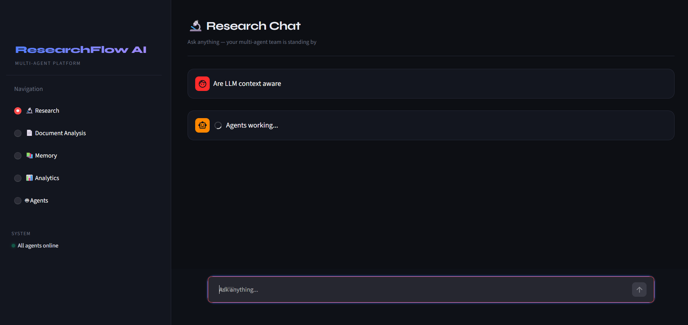

# 🔬 ResearchFlow

**ResearchFlow** is an AI-powered Multi-Agent Research Intelligence Platform designed to automate information gathering, source verification, report generation, knowledge management, and conversational research.

The platform orchestrates multiple specialized AI agents that collaborate to conduct research, evaluate source credibility, generate detailed reports, maintain research memory, and support context-aware follow-up discussions.

Built using **FastAPI**, **Streamlit**, **Groq LLMs**, and a custom Multi-Agent Architecture, ResearchFlow demonstrates how autonomous AI agents can work together to deliver reliable, research-grade insights.


---

# 🚀 Features

## 🤖 Multi-Agent Research System

ResearchFlow uses a team of specialized agents:

| Agent              | Responsibility                              |
| ------------------ | ------------------------------------------- |
| Planner Agent      | Creates a research execution strategy       |
| Research Agent     | Collects information from web sources       |
| Fact Checker Agent | Evaluates source credibility and confidence |
| Writer Agent       | Generates structured research reports       |
| Memory Agent       | Stores research history and summaries       |
| Conversation Agent | Enables contextual follow-up questions      |

---

## 💬 Conversational Research

Unlike traditional search systems, ResearchFlow supports multi-turn research conversations.

Example:

**User:** Tell me about AI in Healthcare

**User:** What are its applications?

**User:** How can hospitals integrate it?

The platform automatically understands context and continues the discussion without requiring users to repeat the topic.

---

## ✅ Source Credibility Analysis

Every retrieved source is automatically evaluated and assigned:

* Credibility Score
* Credibility Level
* Confidence Rating

### Credibility Categories

| Source Type              | Credibility |
| ------------------------ | ----------- |
| Government (.gov)        | Very High   |
| Research Journals        | Very High   |
| Universities (.edu)      | High        |
| Healthcare Organizations | High        |
| Reputable Companies      | Medium      |
| Blogs & Forums           | Low-Medium  |

This ensures research reports prioritize trustworthy information.

---

## 📝 AI-Powered Research Reports

The Writer Agent synthesizes findings into professional reports containing:

* Executive Summary
* Key Insights
* Applications & Use Cases
* Challenges & Risks
* Research Gaps
* Recommendations
* Source Reliability Assessment
* Conclusion
* References

Reports are generated using Groq-hosted Large Language Models.

---

## 📚 Persistent Research Memory

ResearchFlow maintains a memory layer that stores:

* Research Topic
* Generated Summary
* References
* Timestamps
* Research Metadata

This allows users to revisit previous work and continue research sessions seamlessly.

---

## 📊 Analytics Dashboard

The platform provides research analytics including:

* Total Research Queries
* Reports Generated
* Most Researched Topics
* Historical Research Activity
* Research Trends

---

## 📄 PDF Report Export

Generated reports can be exported as professional PDF documents for:

* Academic Projects
* Research Papers
* Business Analysis
* Team Collaboration
* Knowledge Documentation

---

## 📂 Document Analysis

Users can upload:

* PDF
* DOCX
* TXT

documents for further analysis and research augmentation.

---

# 🏗️ System Architecture

```text
User Query
    │
    ▼
Conversation Agent
    │
    ▼
Planner Agent
    │
    ▼
Research Agent
    │
    ▼
Fact Checker Agent
    │
    ▼
Writer Agent
    │
    ▼
Memory Agent
    │
    ▼
Analytics & Storage
    │
    ▼
Research Dashboard
```

---

# ⚙️ Tech Stack

## Backend

* FastAPI
* Python
* Pydantic
* Uvicorn

## Frontend

* Streamlit

## AI Components

* Groq API
* Llama Models
* Multi-Agent Orchestration
* Context-Aware Conversations
* Credibility Assessment Engine

## Storage

* JSON Memory Store

---

# 📁 Project Structure

```text
ResearchFlow/
│
├── backend/
│   ├── app/
│   │   ├── agents/
│   │   ├── api/
│   │   ├── memory/
│   │   ├── models/
│   │   ├── reports/
│   │   └── services/
│   │
│   └── main.py
│
├── frontend/
│   └── streamlit_app.py
│
├── memory_store.json
│
├── requirements.txt
│
└── README.md
```

---

# 🛠️ Installation

## Clone Repository

```bash
git clone https://github.com/yourusername/ResearchFlow.git

cd ResearchFlow
```

## Create Virtual Environment

```bash
python -m venv .venv
```

### Windows

```bash
.venv\Scripts\activate
```

### Linux / Mac

```bash
source .venv/bin/activate
```

## Install Dependencies

```bash
pip install -r requirements.txt
```

---

# 🔑 Environment Variables

Create a `.env` file inside the backend directory:

```env
GROQ_API_KEY=your_groq_api_key

SERPER_API_KEY=your_serper_api_key
```

---

# ▶️ Running the Application

## 1) Start FastAPI backend

Run the backend using the existing script:

```powershell
cd c:\Users\divya\Desktop\PROJECTS\crewai
./run-backend.ps1
```

Backend base URL:

```text
http://localhost:8000
```

---

## 2) Start Streamlit UI

```powershell
cd c:\Users\divya\Desktop\PROJECTS\crewai
streamlit run frontend/streamlit_app.py
```

Frontend:

```text
http://localhost:8501
```


---

# 🔄 Example Workflow

### User Query

```text
AI in Healthcare
```

### Agent Workflow

```text
Conversation Agent
        ↓
Planner Agent
        ↓
Research Agent
        ↓
Fact Checker Agent
        ↓
Writer Agent
        ↓
Memory Agent
```

### Output

* Detailed Research Report
* Credibility Assessment
* Source References
* PDF Export
* Research History Storage

---

# 📈 Current Capabilities

✅ Multi-Agent Research Workflow

✅ Conversational Follow-Up Questions

✅ Source Credibility Assessment

✅ AI-Generated Research Reports

✅ Persistent Research Memory

✅ Analytics Dashboard

✅ PDF Export

✅ Document Analysis

✅ Agent Registry

---

# 🔮 Future Enhancements

* Vector Database Integration
* Retrieval-Augmented Generation (RAG)
* Multi-Document Research
* Research Comparison Mode
* APA/IEEE Citation Generation
* User Authentication
* Cloud Deployment
* Knowledge Graph Construction
* Real-Time Research Monitoring

---

# 🎯 Learning Outcomes

This project demonstrates practical experience with:

* Multi-Agent AI Systems
* Generative AI Applications
* Large Language Models (LLMs)
* FastAPI Development
* Streamlit Development
* Prompt Engineering
* Conversational AI
* Research Automation
* Source Reliability Evaluation
* AI-Powered Knowledge Management

---

# 👨‍💻 Author

**Divya Rewade**

B.Tech Computer Science (AI)

Areas of Interest:

* Artificial Intelligence
* Generative AI
* Multi-Agent Systems
* LLM Applications
* Intelligent Knowledge Platforms
* AI Product Development
